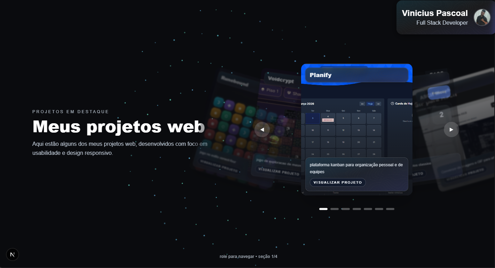

# Portfolio - Vinicius Pascoal

Portfolio pessoal em Next.js com layout em secoes full-screen, animacoes com Framer Motion e fundo interativo por modo.

## Preview



## Stack

- Next.js 16 (App Router)
- React 19
- TypeScript
- Tailwind CSS 4
- Framer Motion
- Lucide React

## Requisitos

- Node.js 20+
- npm 10+

## Como rodar

```bash
npm install
npm run dev
```

Aplicacao local:

- http://localhost:3000

## Scripts

```bash
npm run dev    # ambiente de desenvolvimento (Turbopack)
npm run build  # build de producao
npm run start  # sobe o build
npm run lint   # lint do projeto
```

## Estrutura principal

```text
src/
	app/
		page.tsx
		sections/
			ProjectsCarouselSection.tsx
			AboutSection.tsx
			SkillsSection.tsx
			ContactSection.tsx
		api/
			projetos/
				route.ts
	components/
		CoverflowCarousel.tsx
		ParticlesBackground.tsx
		anim.ts
```

## Como o portfolio esta organizado

- A navegacao principal fica em [src/app/page.tsx](src/app/page.tsx), com 4 secoes em snap vertical.
- Cada secao recebe a prop `isActive` para controlar animacoes e estado visual.
- O endpoint [src/app/api/projetos/route.ts](src/app/api/projetos/route.ts) lista imagens em `public/projetos`.

## Como adicionar ou atualizar projetos no carrossel

1. Adicione a imagem em `public/projetos` com o mesmo nome da chave usada no metadado (exemplo: `planify.png`).
2. Atualize os metadados em [src/app/sections/ProjectsCarouselSection.tsx](src/app/sections/ProjectsCarouselSection.tsx):
	 - `projectMeta` (titulo, subtitulo, link)
	 - `files` (ordem de exibicao)

## Contato e redes

- Os dados da secao de contato ficam em [src/app/sections/ContactSection.tsx](src/app/sections/ContactSection.tsx).
- Itens de contato: array `CONTACTS`.
- Redes sociais: array `SOCIALS`.

## Deploy

Ambiente de producao (Vercel):

- https://viniciusp-portfolio.vercel.app/
